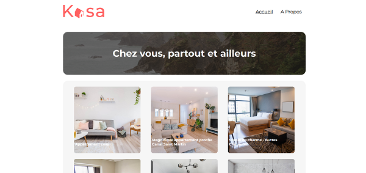
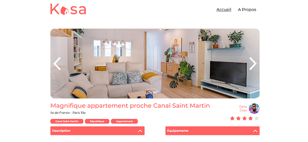
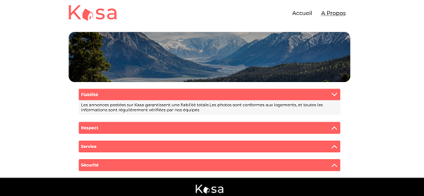

# Kasa Front-End

## Description

My first React project.
Kasa is a website that allows property owners to rent out their accommodations.

Developed with React, SCSS, and Figma mockups, this project highlights various accommodations. Photos, descriptions, and ratings are provided to help you choose the perfect place.

## Stack

-   React
-   SCSS
-   Figma

## Installation

Clone the project

```bash
  git clone https://github.com/Yacine-Di/kasa.git
```

### `npm start`

Runs the app in the development mode.\
Open [http://localhost:3000](http://localhost:3000) to view it in your browser.

The page will reload when you make changes.\
You may also see any lint errors in the console.

## Lessons Learned

During this project I learned how to create react components. How to use React Router. How to get id with useParams.

## Screenshots

Home page <br>


Accommodation page <br>


About page <br>


## Authors

[Yacine D](https://github.com/Yacine-Di)
